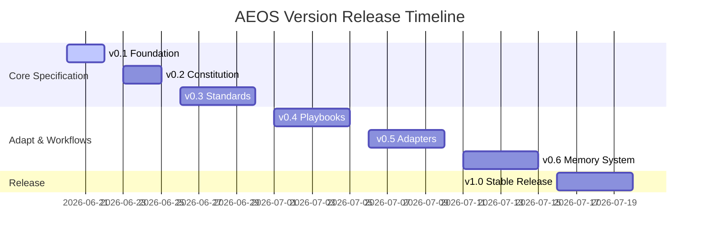

# 📋 AI Engineering OS (AEOS) v0.1 Product Requirements Document (PRD)

This document defines the core product specifications, target features, risk policy, and milestones for **AI Engineering OS (AEOS) v0.1 Foundation**.

---

## 1. Vision & Core Rationale

### 1.1 The Problem
In modern "Vibe Coding" setups, developers face several friction points:
- **Rule Inconsistency**: Different AI tools (e.g., Cursor, Claude Code, Cline) execute code using their own ad-hoc instructions. Switching agents causes rules to clash or be ignored.
- **Platform Lock-in**: Prompt configurations are tightly coupled with the host client (e.g., `.cursorrules`), making them useless on other clients.
- **Uncontrolled Context Swelling**: Prompts grow indefinitely, consuming token budgets and causing context pollution.
- **Security & Risk Exposure**: Agents are either too constrained (refusing to execute commands) or too free (running destructive actions without human permission).

### 1.2 The Solution
AEOS establishes a **Platform-Agnostic AI Operating System**. It defines:
1. A standard folder layout for AI rules, playbooks, and templates.
2. A structured, self-documenting project memory system.
3. An adapter translation layer that compiles AEOS rules into client-specific rules.
4. An L0-L7 authorization framework to govern security and permissions.

---

## 2. Core Features & Functional Specifications

### 2.1 The L0-L7 Authorization & Approval Policy
Different operations represent different risk levels. AEOS establishes a standardized scale of approval requirements:

| Risk Level | Level Name | Operation Examples | Approval Requirement |
| :--- | :--- | :--- | :--- |
| **L0** | Read-Only | Reading source code, searching files, directory listing | 🟢 **Fully Auto**: No approval needed. |
| **L1** | Local Query | Web search, reading documentation links | 🟢 **Fully Auto**: No approval needed. |
| **L2** | Minor Write | Creating/editing documentation, templates, or markdown logs | 🟢 **Fully Auto**: No approval needed. |
| **L3** | Safe Refactor | Code format, lint fixes, renaming variables, local compile | 🟢 **Fully Auto**: No approval needed. |
| **L4** | Major Write | Modifying core codebase logic, editing database schemas | 🟡 **Auto-Heal or Notify**: Auto-executes, but logs must be sent to chat immediately. |
| **L5** | Command Execution | Running test suites, starting local dev servers | 🟡 **Conditional Approval**: Prompt user for permission once per task. |
| **L6** | Infrastructure Modify | Modifying environment variables, installing node packages | 🔴 **Strict Approval**: User must explicitly approve in the client UI. |
| **L7** | High Risk / Release | Pushing code to main branch, deleting database, cloud deploy | 🔴 **Double-Check Approval**: Double confirmation prompt required. |

---

### 2.2 The Structured Memory Schema
Instead of scanning the whole directory repeatedly, the AI Agent reads and writes to structured memory files in the `memory/` directory:

- **PROJECT_CONTEXT.md (Static)**: High-level overview, architecture stack, core modules, and business domains.
- **DECISIONS.md (Versioned)**: An index of ADRs (Architecture Decision Records) detailing technical pivots.
- **TECHNICAL_DEBT.md (Dynamic)**: Tracking code smells, missing tests, and refactoring items.
- **LESSONS_LEARNED.md (Dynamic)**: Retrospective logs of past errors, config tricks, and environment pitfalls.
- **ROADMAP.md (Static)**: Future target milestones and feature checklists.

---

### 2.3 Engineering Quality Metrics
AEOS defines standard metrics to measure the health of a workspace:

- **Documentation Coverage**: Ratio of commented code blocks and documentation files to total codebase size. Target: `> 90%` for key interfaces.
- **Architecture Health**: Compliance with Hexagonal/SOLID principles, measured by the lack of circular dependencies.
- **Test Coverage**: Percentage of code statements covered by automated test suites. Target: `> 80%` for business logic.
- **Memory Integrity**: Sync status of `.md` logs in the `memory/` folder. Must be updated after every release turn.

---

## 3. Product Roadmap & Milestones

- **v0.1 Foundation (Current)**: Finalize Vision, Research, PRD, and High-Level Architecture.
- **v0.2 Constitution**: Define highest principles, Risk control levels (L0-L7), and definition of done.
- **v0.3 Standards**: Define coding style, testing rules, Conventional Commits, and Git Flow rules.
- **v0.4 Playbooks**: Deliver best practices for Web apps, Bots, and CLI tools.
- **v0.5 Adapters**: Deliver Antigravity Adapter, Claude Code Adapter, and Cursor Adapter.
- **v0.6 Memory System**: Deliver the JSON/Markdown memory synchronization schema.
- **v1.0 Stable**: Production deployment and multi-agent compliance validation.
