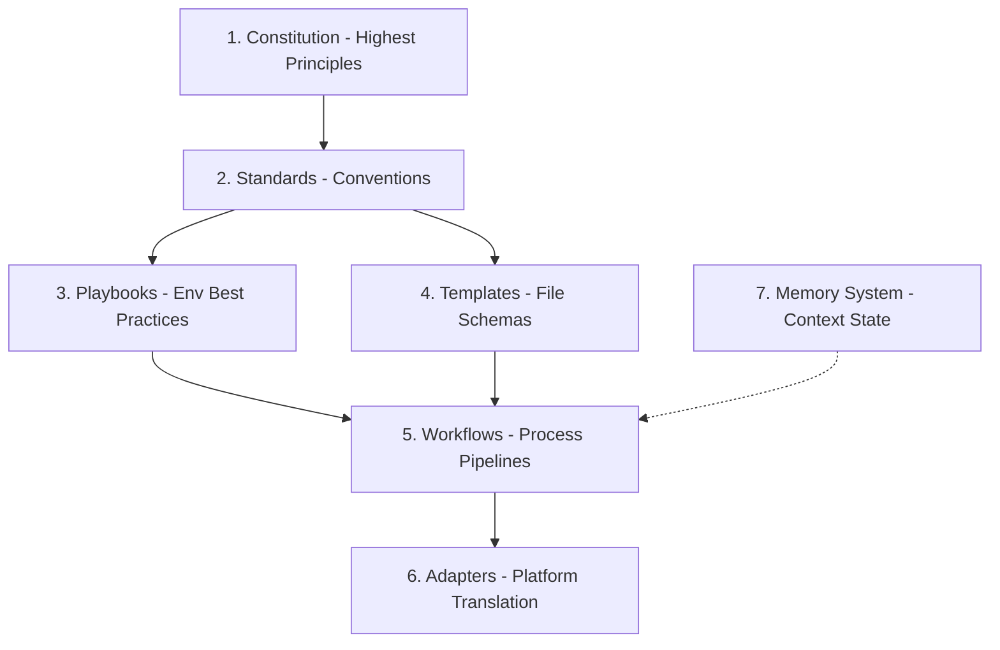

# 📐 AI Engineering OS (AEOS) v0.1 System Architecture

This document describes the structural layout, information flows, integration adapters, and safety middleware design for the **AI Engineering OS (AEOS)**.

---

## 1. High-Level Modular Design

AEOS is organized into decoupled, highly cohesive modules. The dependencies flow downwards:



### 1.1 Directory Specification

- **`constitution/`**: Defines identity, core safety, L0-L7 permissions, and verification gates. Highly stable; changes require a formal RFC.
- **`standards/`**: Maintain individual coding style, testing, logging, and Git conventions. Agent-agnostic.
- **`playbooks/`**: Specific stack/environment cookbooks (e.g., Node.js bot playbook, React playbook). Inherits `standards/`.
- **`templates/`**: File structures (PRDs, ADRs, Postmortems). Ensure standard information layout.
- **`workflows/`**: Process steps (Task Breakdown -> Coding -> Test -> Review -> Commit). Directs how the agent transitions from one task status to another.
- **`adapters/`**: The translation module. Compiles the markdown definitions from `constitution`, `standards`, etc., into format-compliant files for Cursor (`.cursorrules`), Cline (`.clinerules`), Antigravity (`AGENTS.md`), etc.
- **`memory/`**: Dynamic workspace log repository. Stores structured facts, known bugs, decisions, and technical debt.

---

## 2. Adapter Translation Mechanism

AEOS is platform-independent. Adapters act as compiler drivers that bundle the core rules and generate target configurations.

```text
┌─────────────────────────────────────────────────────────────┐
│                       AEOS Core Config                      │
│ (constitution/standards/workflows/templates/playbooks)      │
└──────────────────────────────┬──────────────────────────────┘
                               │
                ┌──────────────┴──────────────┐
                ▼                             ▼
       ┌────────────────┐            ┌────────────────┐
       │   Cursor rule  │            │  Antigravity   │
       │   generator    │            │   formatter    │
       └────────┬───────┘            └────────┬───────┘
                ▼                             ▼
       ┌────────────────┐            ┌────────────────┐
       │  .cursorrules  │            │   AGENTS.md    │
       │  (JSON/text)   │            │   (Markdown)   │
       └────────────────┘            └────────────────┘
```

### 2.1 The Adapter Schema (DSL Concept)
A typical adapter maps core files to specific outputs:
```json
{
  "adapter_name": "Antigravity",
  "mappings": [
    {
      "source_paths": [
        "constitution/identity.md",
        "constitution/approval_policy.md",
        "standards/git_standards.md"
      ],
      "output_path": ".agents/AGENTS.md",
      "format": "markdown_concat",
      "prefix": "# Workspace Agent Instructions\n"
    }
  ]
}
```
This ensures the core specifications remain pristine, while each tool consumes it in the format it parses best.

---

## 3. Structured Memory System (State Interchange)

Instead of forcing the agent to read all files on startup, AEOS provides a structured state log that is updated after every turn.

```text
┌────────────┐     Read Memory     ┌──────────────────┐
│  AI Agent  ├────────────────────►│ memory/          │
│            │                     │  PROJECT_CONTEXT │
└─────┬──────┘                     │  TECHNICAL_DEBT  │
      │                            │  ROADMAP         │
      │ Execute Task               └────────┬─────────┘
      ▼                                     ▲
┌────────────┐                              │
│ Workspace  ├──────────────────────────────┘
│ Code Change│       Update Memory (Definition of Done)
└────────────┘
```

- **Static Memory**: Loaded once on startup (`PROJECT_CONTEXT.md`, `ARCHITECTURE.md`).
- **Dynamic Memory**: Loaded and updated after every development loop (`TECHNICAL_DEBT.md`, `LESSONS_LEARNED.md`). Before committing code, the agent **MUST** update these logs to preserve continuity for the next session.

---

## 4. Approval Level Guardrails (L0-L7 Security Middleware)

The client adapter acts as a security middleware, intercepting agent tool calls and matching them against the `approval_policy.md` specification:

```text
[Agent Tool Call]
       │
       ▼
┌────────────────────────────────────────────────────────┐
│  Adapter Middleware (Checks tool against L0-L7 rules)  │
└──────────────────────────┬─────────────────────────────┘
                           │
             ┌─────────────┴─────────────┐
             ▼                           ▼
      [Level <= L3]               [Level >= L4]
             │                           │
             ▼                           ▼
      🟢 Execute Auto             🔴 Prompt User for Consent
```

1. **L0-L3 (Safe Queries/Refactors)**: Executed silently in the sandbox without disrupting the developer.
2. **L4 (Major Code Write)**: Allowed to execute, but the adapter immediately sends a summary notification of the changed files to the chat UI.
3. **L5-L7 (Commands/Env Modifies/Deploys)**: The adapter intercepts execution and triggers the client UI's permission modal, blocking further progress until consent is granted.
