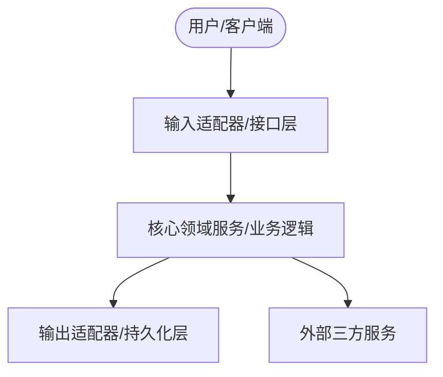

# 📐 系统架构设计 (Architecture Design) 模板

> [!NOTE]
> **使用指南**：本模板用于指导系统架构、数据库结构及接口契约的设计工作。在进行重大架构修改或新组件设计时，智能体必须优先输出基于此模板的架构设计文档，评审通过后方可编码。

---

## 📄 文档基本信息

| 属性 | 内容 |
| :--- | :--- |
| **项目名称** | `[填写项目名称]` |
| **文档版本** | `v0.1.0-draft / v1.0.0-stable` |
| **设计日期** | `YYYY-MM-DD` |
| **主架构师** | `[智能体身份或架构师名称]` |
| **对应 PRD** | `[链接到相关的 PRD 文件]` |

---

## 一、 架构愿景与设计原则 (Vision & Principles)

### 1.1 系统核心演进愿景
> 简要说明为什么要设计该架构，它需要解决什么高层级技术挑战（如高并发、松耦合、跨平台）。
- `[系统架构的演进主轴描述]`

### 1.2 架构设计原则 (SOLID / Hexagonal)
- **单一职责原则 (SRP)**：每个模块仅负责单一业务职责（如 `db_manager.js` 仅负责 SQLite 读写）。
- **端口与适配器 (Hexagonal)**：核心业务逻辑与外部 I/O 驱动隔离，通过统一接口对接，以便随时平替（如更换消息 SDK）。

---

## 二、 系统拓扑与层级解耦 (Topology & Decoupling)

### 2.1 模块依赖流动拓扑 (Mermaid Diagram)
> 使用 Mermaid 流程图描述组件分层与单向依赖关系。


### 2.2 核心目录职责定义
- **目录 1 (`/core`)**：`[描述该目录的职责及包含的文件类别]`
- **目录 2 (`/adapters`)**：`[描述该目录的职责及包含的文件类别]`
- **目录 3 (`/tests`)**：`[描述该目录的职责及包含的文件类别]`

---

## 三、 核心接口契约与数据流 (Interfaces & Data Flow)

### 3.1 核心数据结构与 Schema 定义
> 详细描述内存对象的数据结构，或数据库的 Table Schema 结构。
```sql
CREATE TABLE IF NOT EXISTS [table_name] (
    id TEXT PRIMARY KEY,
    status TEXT NOT NULL,
    created_at INTEGER NOT NULL,
    metadata TEXT -- JSON 格式的扩展字段
);
```

### 3.2 接口 API 与函数签名定义
> 定义核心服务对外的接口函数及参数类型。
```javascript
/**
 * 执行某核心任务的通用接口
 * @param {string} taskId - 任务的唯一标识 ID
 * @param {object} payload - 附加载荷数据
 * @returns {Promise<boolean>} 是否执行成功
 */
async function executeTask(taskId, payload) {
  // [此处描述处理流程]
}
```

---

## 四、 持久化与并发策略 (Persistence & Concurrency)

### 4.1 SQLite / 文件系统读写策略
- **WAL 模式配置**：`PRAGMA journal_mode=WAL;`
- **读写忙等待重试机制**：`PRAGMA busy_timeout=5000;`

### 4.2 锁与死锁防范策略
- **排他锁应用**：`[描述如何对临界区写操作进行加锁]`
- **自动回收机制**：当父进程异常退出时，如何释放数据库连接锁资源（见 Node.js Bot 自毁 SOP）。

---

## 五、 安全与异常边界机制 (Security & Error Boundary)

### 5.1 参数转义与命令防注入
- 执行 shell 命令时必须将参数以数组列表形式传递，禁止拼接字符串：
  ```javascript
  // 推荐方式
  execFile('node', ['script.js', param1, param2]);
  ```

### 5.2 降级与容灾备份 (Fallback)
- 当外部网络接口（如飞书文档 API）超时离线时，系统降级逻辑为：
  - `[描述降级降频方案，例如从本地缓存/Mock 数据读取]`
